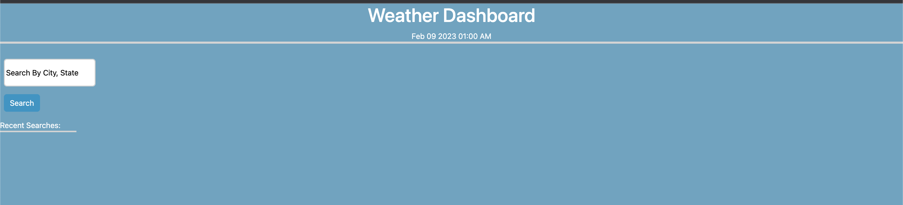
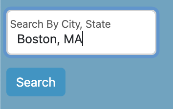
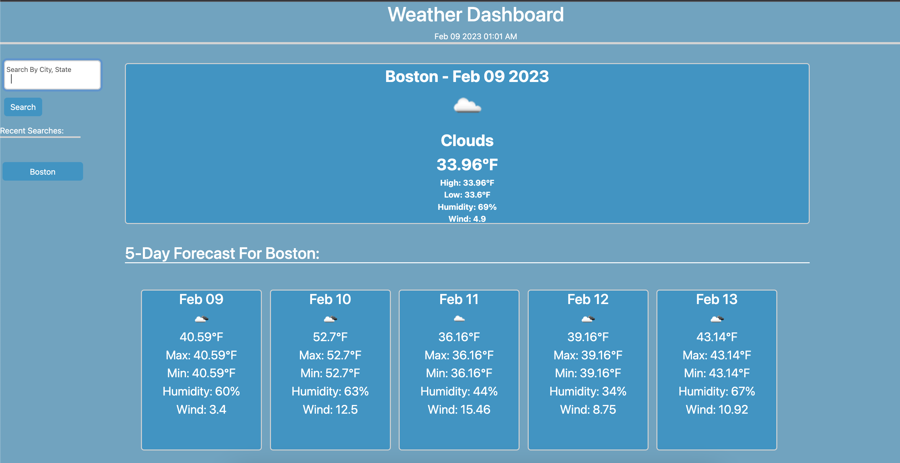
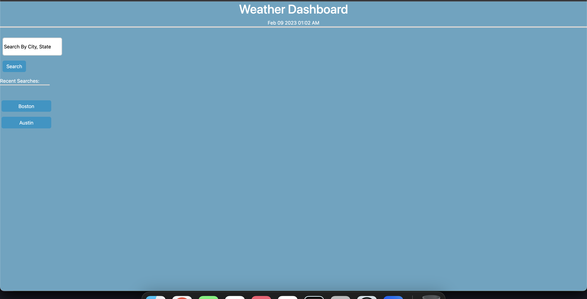

# Weather Dashboard
## An application that displays weather forecast by searched city:

I wanted to create a basic weather application that worked with the openweatherAPI to get weather information for the searched city and displayed the current weather as well as the weather for the next 5 days. With this project, I had some requirements to make it functional in terms of actual use. 

This criteria was:

    1. A search form that takes in user input city name
    2. The searched for city is then added to the search history, and the current weather conditions as well as the future weather conditions for the next 5 days are displayed
    3. The weather information displayed consists of: 
        -City name
        -Date of forecast
        -An icon that displays the weather conditions
        -Overall temperature
        -High temperature
        -Low temperature
        -The humidity conditions
        -The wind speed
    4.When a user would like to see the weather conditions of a previously searched city, they're able to click on a button that has the city's name on it, and the forecasts for that city are then regenerated and displayed
   

This project was a real challenge for me, and I really struggled with certain aspects of this program for the following reasons:

- I was still not strong with jquery functions and DOM transversal
- I was still not strong with working with the localstorage aspects of: 
  - Persisting data
  - Calling back data
  - Checking if data existed within localstorage without throwing null errors
- I was not familiar enough with making API calls, fetching and handling said data

I ended up learning a great deal more about jquery, and feel like I finally have a better understanding of API fetch request and parsing through the data.

## Installation
---
N/A
## Usage

The program can be used at the following deployment link: https://corradoj02.github.io/Weather-Dashboard/

When the user first opens the page they'll be greeted with the main page that displays the header with the current date/time, and a search bar:

Then a user can enter a city into the search bar and enter their city with a search button, or use the "enter" key:

When the input is entered, the forecast for the searched city is displayed and the city is then added to the "Recent Searches:" section as a clickable button to regenerate forecasts for the chosen city:

A user can enter in a different city, and that city will then get added to the recent searches as well as the forecasts for the new city will be displayed:

If a user decides to move to a different page or refresh, their previous cities will be pulled from client-side storage and be displayed under their recent searches:

## Credits
---
OpenweatherAPI (5Day/3Hour): https://openweathermap.org/forecast5#5days
## License
---
N/A

---